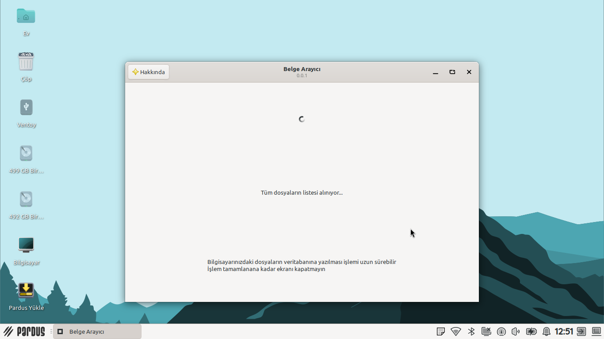
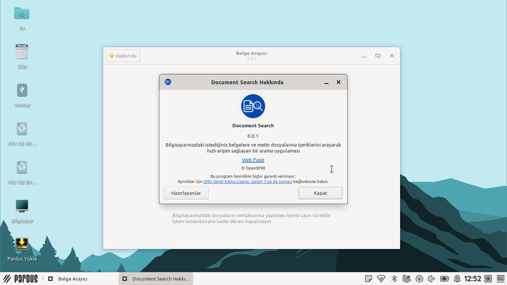
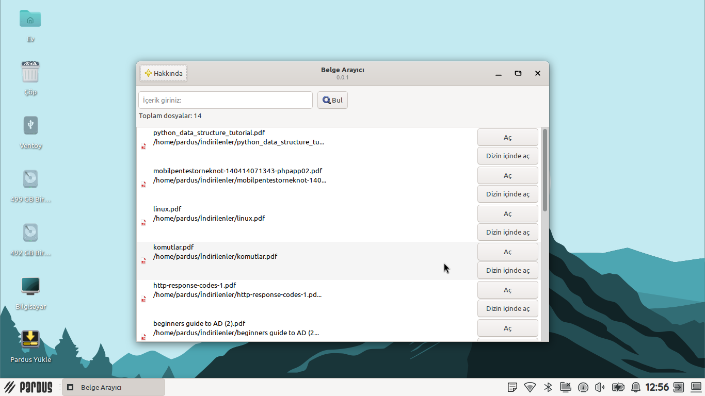
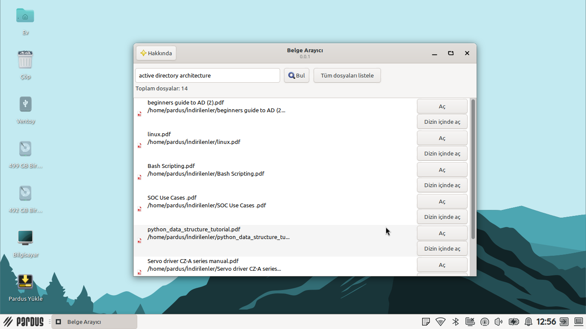
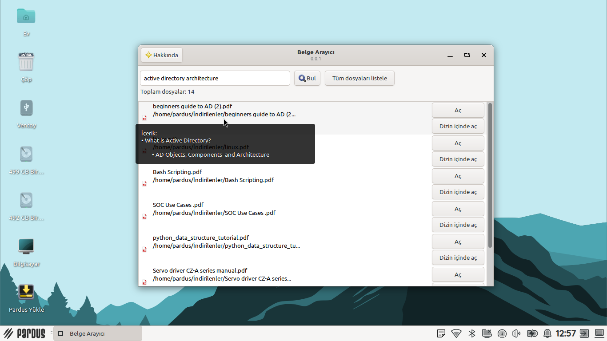
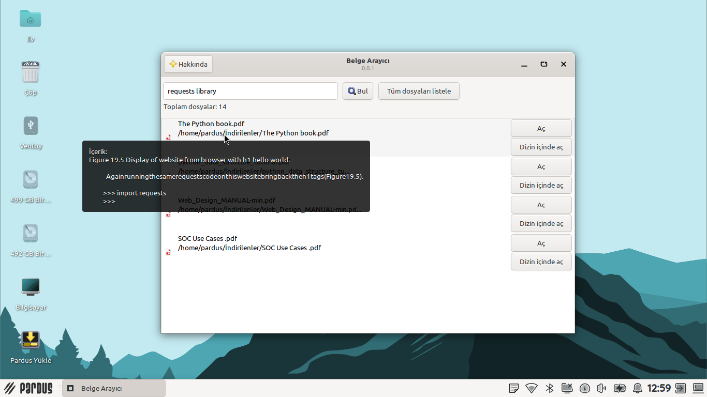
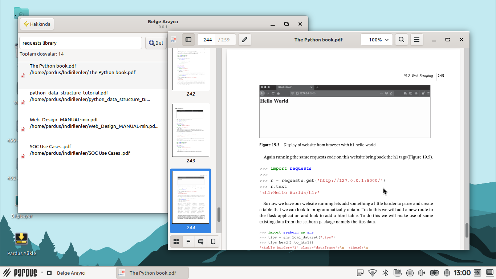

# DocSearch
A search application that provides quick access to the documents and text files you want on your computer by searching their contents

---

## About

Searching through hundreds of documents for a specific piece of content can be tedious. DocSearch solves this by indexing all supported files into a local SQLite database and running full-text searches using the BM25 (Best Match 25) algorithm — returning the most relevant results in milliseconds.

---

## Features

- **BM25-based search** — An advanced ranking algorithm that accounts for term frequency and document length to deliver highly relevant results
- **SQLite indexing** — File contents are stored in a local database, keeping searches fast and lightweight
- **Wide file format support** — Supports PDF, TXT, DOCX, and other text-based formats
- **GTK interface** — A clean, user-friendly interface compatible with GNOME desktop environments

---

## Requirements

### System Requirements

- Python 3.x
- SQLite (typically bundled with Python)

### Python Dependencies

```
rank-bm25
pyPDF2
fitz
pdfplumber
PyGObject
```

---

## Installation

### 1. Clone the repository

```bash
git clone https://github.com/heyderismayilli092/docsearch.git
cd docsearch
```

### 2. Install dependencies

```bash
pip install -r requirements.txt
```

### 3. Run the installer

```bash
sudo python3 ~/docsearch/src/main.py
```

---

### Build .deb package
```bash
sudo apt install devscripts git-buildpackage
sudo mk-build-deps -ir
gbp buildpackage --git-export-dir=/tmp/build/docsearch -us -uc
```

---

### **Screenshots**










---


## How It Works

```
File System
     │
     ▼
[docextract.py]          ← Extracts text from PDF, TXT, DOCX files
     │
     ▼
[docdatabase.py]         ← Stores extracted text in SQLite database
     │
     ▼
[docsearch_functions.py] ← Runs BM25 search against the database
     │
     ▼
[GTK Interface]          ← Displays ranked results to the user
```

---

## Author

**Heydar Ismayilli**
- GitHub: [@heyderismayilli092](https://github.com/heyderismayilli092)
- Email: heyderismayilli092@gmail.com

NOTE: This software was prepared as part of the "Teknofest 2026 Pardus Bug Finding and Suggestion Competition"

